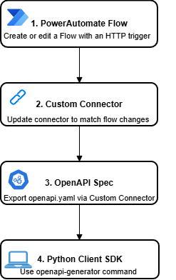
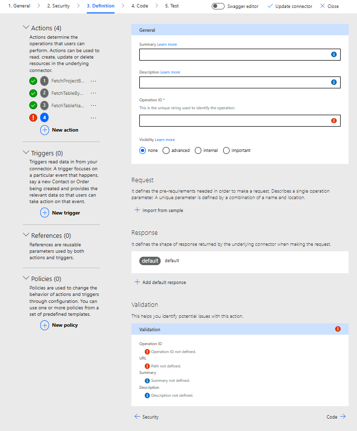

# allen-powerplatform-client

A Python client library for triggering PowerAutomate workflows.

## Auto-generated Client Code
- The client is autogenerated using an openapi generator.
- The client can be pip installed as `pip install allen-powerplatform-client`

## Contributing

**Important**: Contributors should **only** edit the OpenAPI specification through PowerAutomate's Custom Connector interface, not by directly modifying the `openapi.yaml` file.

The general contribution workflow is as follows:




### 1. Update/Create PowerAutomate Flows

- Navigate to PowerAutomate and locate the relevant flow (or create a new one)
- Make necessary changes to the flow logic, inputs, or outputs in the PowerAutomate editor
- Test the flow thoroughly to ensure it works as expected
- Note any changes to input/output schemas

### 2. Update the Custom Connector



- Open PowerAutomate's Custom Connector interface (connector name: "allen-powerplatform-client")
- In the connector's definition, update/add an action to reflect any changes made to the PowerAutomate flows
- This may include:
  - Adding new operations/endpoints for new flows:
    - Select "+ New Action" and fill in General details.
    - To define the Request, select "Import from Sample" and copy the HTTP trigger URL of the flow.
    - Add a default response schema to ensure the flow's response is serialized correctly.
  - Modifying existing operation parameters:
    - Modify desired action as necessary. Ensure request and response definitions are as expected. 
- Once changes are complete, update connector and test to ensure it properly triggers the flows

<br clear="right">


### 3. Export the Updated OpenAPI Specification

- Once the Custom Connector is updated and tested, export the OpenAPI specification. Turn on "Swagger editor" in the Custom Connector.
- Copy the exported API spec into the contents of `openapi.yaml` in this repository
- **Do not manually edit the `openapi.yaml` file** - it should only be updated through the Custom Connector export process

### 4. Generate the Client
- The python client is generated using openapi-generator. 

```bash
docker run --rm \
  -v "$(pwd)":/local \
  openapitools/openapi-generator-cli generate \
  -i /local/openapi.yaml \
  -g python \
  -o /local/python-client \
  -c /local/openapirc_python_client.json \
  --ignore-file-override /local/.openapi-generator-ignore
```
Note: The openapi-generator command is expected to run during github actions to automatically update the python client on a push to main. You can run this command to test locally, but the repository's client should only be updated through Github workflows. 

### 5. Using the Client

#### Install
```bash
pip install -e ./python-client
pip install requests
```

#### Basic Usage
```python
import os
import requests
from allen_dataverse_client import DefaultApi, Configuration, ApiClient, FetchProjectByNameRequest

# Get OAuth token
token_url = f"https://login.microsoftonline.com/{os.environ['DATAVERSE_TENANT_ID']}/oauth2/v2.0/token"
payload = {
    'grant_type': 'client_credentials',
    'client_id': os.environ['DATAVERSE_CLIENT_ID'],
    'client_secret': os.environ['DATAVERSE_CLIENT_SECRET'],
    'scope': 'https://service.flow.microsoft.com//.default'
}
token = requests.post(token_url, data=payload).json()['access_token']

# Configure client
config = Configuration()
config.host = f"https://{os.environ['DATAVERSE_HOST']}"
config.access_token = token
api = DefaultApi(ApiClient(config))

# Use the client to fetch project data
response = api.fetch_project_by_name(
    api_version=1,
    body=FetchProjectByNameRequest(project_name="CCF Template")
)

# Use the client to fetch table names
response = api.fetch_table_names(
  api_version=1
)

# Use the client to fetch full table data
response = api.fetch_table_by_name(
  api_version=1,
  body={"tableName": "cr138_projects"}
)

```
Note: Note that the body for each of these actions can either be a dictionary with required params, or an object generated by the client (ex: `FetchProjectByNameRequest`). See generated client for more details. 

### Production Usage

For production deployments, consider implementing:
- **Token caching** to avoid frequent token requests
- **Wrapper class** to encapsulate OAuth logic

## Available Endpoints

The API endpoints correspond to PowerAutomate flow triggers. All endpoints use PowerAutomate workflow IDs as path parameters, making them configurable across different environments (dev/prod) via environment variables. To learn more how to use the client, see python-client/README.md.
