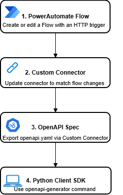
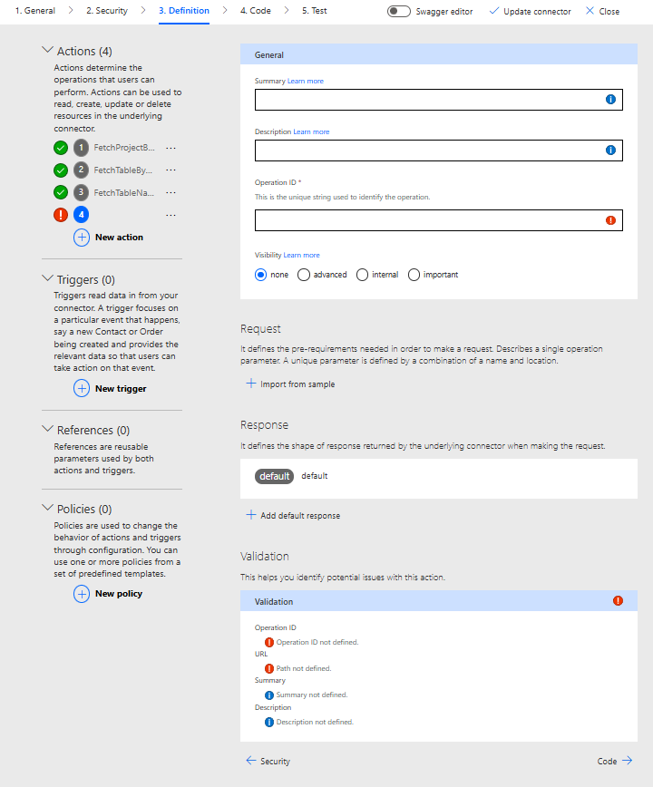

# allen-powerplatform-client

A Python client library for triggering PowerAutomate workflows. The client is auto-generated from OpenAPI specs exported from PowerPlatform Custom Connectors.

This repo maintains two environments:
- **prod** — published to PyPI, generated from `aind_api_connector_prod_openapi.yaml`
- **dev** — committed to `clients/python-client-dev/` on main, installable directly from GitHub

## Installation

```bash
# prod (from PyPI)
pip install allen-powerplatform-client

# dev (from this repo)
pip install "git+https://github.com/AllenNeuralDynamics/allen-powerplatform-client@main#subdirectory=clients/python-client-dev"
```

## Basic Usage

```python
import requests
from allen_powerplatform_client import DefaultApi, Configuration, ApiClient

# Get OAuth token using client credentials
token_url = "https://login.microsoftonline.com/<tenant-id>/oauth2/v2.0/token"
payload = {
    "grant_type": "client_credentials",
    "client_id": "<client-id>",
    "client_secret": "<client-secret>",
    "scope": "https://service.flow.microsoft.com//.default",
}
token = requests.post(token_url, data=payload).json()["access_token"]

# Configure client
config = Configuration()
config.host = "https://<powerplatform-host>"
config.access_token = token
api = DefaultApi(ApiClient(config))

# Fetch all data for a table
response = api.get_table(api_version=1, body={"table_name": "cr138_projects"})

# Post a weight record
response = api.post_weight_record(
    api_version=1,
    body={
        "mouse_ID": "111111",
        "weight": 25.0,
        "date_time": "2025-12-19T11:00:00-08:00",
        "is_baseline_weight": False,
        "operator_userGUID": "<user-guid>",
        "software_source": "my-app",
        "software_version": "1.0.0",
    },
)
```

The request body can be a plain dict or a typed model from the generated client (e.g. `PostWeightRecordRequest`). See `clients/prod/README.md` for full API docs.

## Contributing

**Important**: Contributors should **only** edit the OpenAPI specification through PowerAutomate's Custom Connector interface, not by directly modifying the `openapi.yaml` file.

The general contribution workflow is as follows:



### 1. Update/Create PowerAutomate Flows

- Navigate to PowerAutomate and locate the relevant flow (or create a new one)
- Make necessary changes to the flow logic, inputs, or outputs in the PowerAutomate editor
- Test the flow thoroughly to ensure it works as expected
- Note any changes to input/output schemas

### 2. Update the Custom Connector



- Open PowerAutomate's Custom Connector interface
- Update or add an action to reflect changes to the flows:
  - For new operations: select **+ New Action**, fill in details, and import the HTTP trigger URL via **Import from Sample**
  - For existing operations: update parameters and verify request/response definitions
- Test the connector to confirm it properly triggers the flows

<br clear="right">

### 3. Export the Updated OpenAPI Specification

- Turn on **Swagger editor** in the Custom Connector and export the spec
- Copy the exported spec into the appropriate file:
  - `aind_api_connector_dev_openapi.yaml` for dev connector updates
  - `aind_api_connector_prod_openapi.yaml` for prod connector updates
- Do not manually edit these files

### 4. Client Generation (automated)

Pushing changes to either OpenAPI spec on `main` automatically triggers regeneration via GitHub Actions:
- Changes to `aind_api_connector_prod_openapi.yaml` → regenerates `clients/prod/`, publishes to PyPI
- Changes to `aind_api_connector_dev_openapi.yaml` → regenerates `clients/dev/`, commits to main

To regenerate locally with Docker:

```bash
# prod
docker run --rm -v "$(pwd)":/local openapitools/openapi-generator-cli generate \
  -i /local/aind_api_connector_prod_openapi.yaml -g python \
  -o /local/clients/prod -c /local/openapirc_python_client.json \
  --ignore-file-override /local/.openapi-generator-ignore

# dev
docker run --rm -v "$(pwd)":/local openapitools/openapi-generator-cli generate \
  -i /local/aind_api_connector_dev_openapi.yaml -g python \
  -o /local/clients/dev -c /local/openapirc_python_client.json \
  --ignore-file-override /local/.openapi-generator-ignore
```

